<div align="center">
<h1>dynamic-object-removal-aerial</h1>
<h3>Dynamic Object Removal and Background Reconstruction in Aerial Images Using Global Alignment and YOLOv12</h3>
Chi Hung Wang<sup>1</sup>, Yu Siang Siang<sup>2</sup>, Xiang Shun Yang<sup>3</sup>, Wei Ren Chen<sup>4</sup>, Jun Jie Yen<sup>5</sup>

Dept. of Artificial Intelligence Technology and Application, Feng Chia University, Taichung, Taiwan

  
[](https://www.python.org/downloads/)
[](https://opensource.org/licenses/MIT)
</div>

## Abstract

Aerial imagery is widely used in intelligent traffic management and urban planning. However, dynamic objects (such as vehicles and pedestrians) often occlude road signs and traffic markings, reducing the accuracy of image analysis. Although traditional methods can partially restore the background, they face issues such as high computational cost, blurred details, and background misalignment when handling large-scale aerial data. To overcome these challenges, this study proposes a background reconstruction method that integrates global alignment, object recognition, and weighted averaging. First, RANSAC with Homography is used to align multiple images, correcting spatial errors caused by UAV shake or viewpoint shifts. Then, in the aligned image sequence, dynamic objects are detected by combining depth estimation, frame differencing, and the YOLOv12 model, producing accurate dynamic masks. At this stage, the detection model achieves a Precision of 0.917, Recall of 0.886, F1-score of 0.901, and AP of 0.946, demonstrating strong performance. Finally, using the dynamic masks, weighted background averaging is applied to remove dynamic regions and restore a stable, clear background. Experimental results show that the proposed method outperforms traditional averaging and generative models (such as GANs and Diffusion) in preserving traffic details like crosswalks, lane markings, and directional indicators. This approach is suitable for intelligent traffic monitoring, UAV image analysis, and urban planning. The project of this work is made publicly available at https://github.com/seannnnnn1017/dynamic-object-removal-aerial.

## Apporach
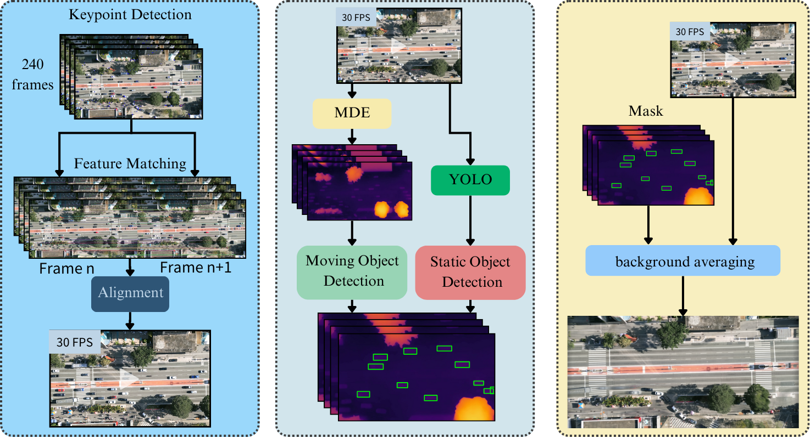


## Installation

1. Clone the repository:
```bash
git clone https://github.com/seannnnnn1017/dynamic-object-removal-aerial.git
cd dynamic-object-removal-aerial
```

2. Set up the environment and install dependencies:

### Option 1: Using Conda (Recommended)
```bash
# Create and activate conda environment
conda create -n aerial python=3.8
conda activate aerial

# Install PyTorch with CUDA support (adjust cuda version as needed)
pip install torch torchvision torchaudio --index-url https://download.pytorch.org/whl/cu126

# Install other dependencies
pip install -r requirements.txt

# Install additional Conda packages
conda install -c conda-forge opencv matplotlib pandas seaborn
conda install -c conda-forge jupyter ipykernel
```

### Option 2: Using Python venv
```bash
# Create and activate virtual environment
python -m venv venv
source venv/bin/activate  # On Windows: venv\Scripts\activate

# Install dependencies
pip install --upgrade pip
pip install -r requirements.txt
```

Note: If you encounter any CUDA compatibility issues, please refer to the [PyTorch installation guide](https://pytorch.org/get-started/locally/) and select the appropriate version for your system.

## Dataset Description

The dataset follows the YOLOv12 format with both palm print (RGB) and palm vein (NIR) images. Dataset configuration can be found in `configs/dataset.yaml`.


### Data Format
- Images: `.jpg` format
- Labels: YOLOv12 format text files
- Directory Structure: Follows YOLO convention with `train/`, `val/`, and `test/` splits

## Training & Evaluation

1. Training: 
```bash
python YoloV12/train.py 
```

2. Inference:
```bash
python YoloV12/predict.py --weights checkpoints/yolov12_best.pt --source path/to/image
```
## Main Results

**Comparison of YOLOv10, YOLOv11, and YOLOv12**:
**Performance Comparison of Different Dynamic Object Detection Methods**

| Method                    | Precision | Recall | F1-score | AP    |
|--------------------------|-----------|--------|----------|-------|
| Traditional Differencing | 0.163     | 0.353  | 0.223    | 0.233 |
| YOLOv12 only             | 0.543     | 0.671  | 0.600    | 0.946 |
| Depth-Difference-YOLOv12 | 0.917     | 0.886  | 0.901    | 0.972 |
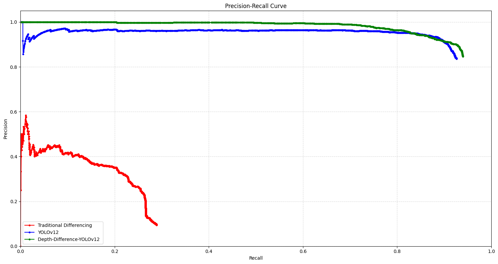

### Performance Visualization

| Original | LaMa | Ours |
|----------|------|------|
| 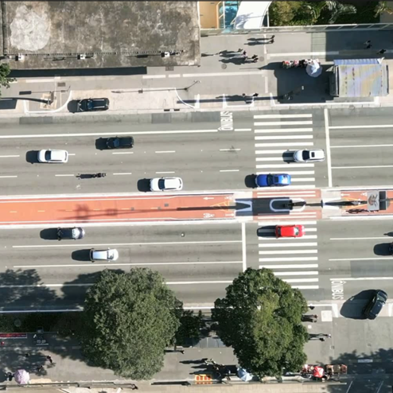 | 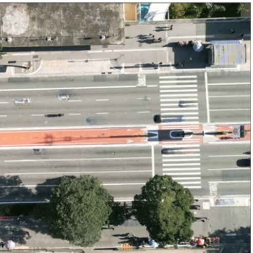 | 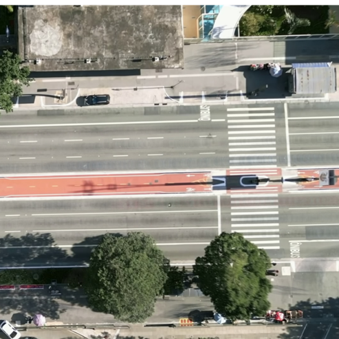 |
| 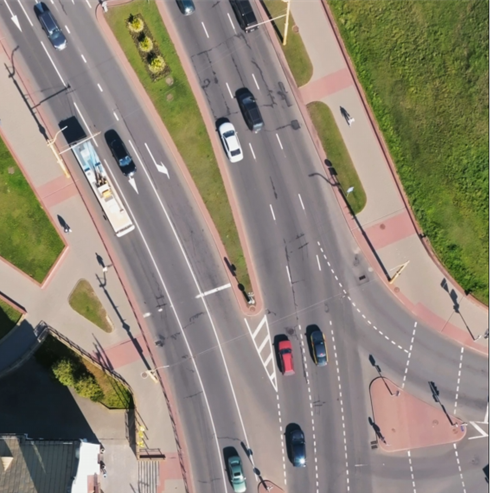 | 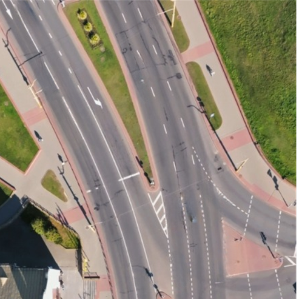 | 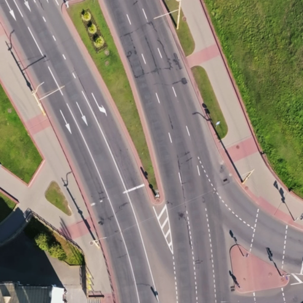 |
| 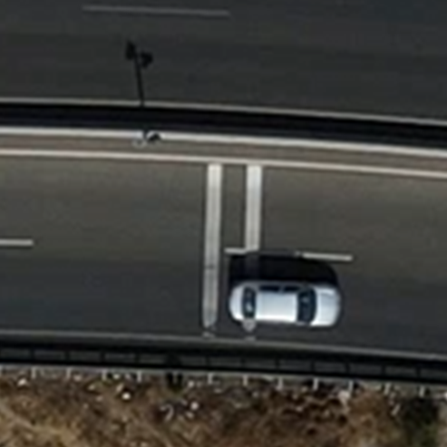 | 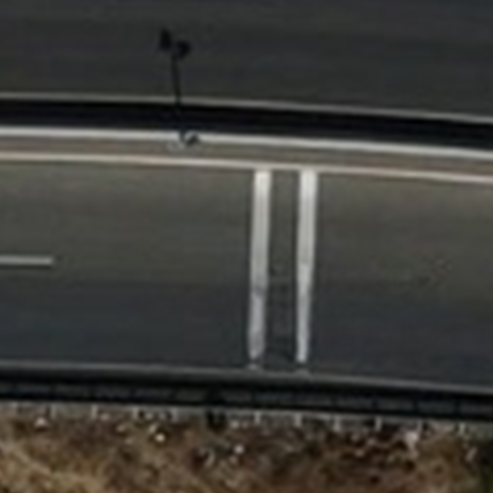 | 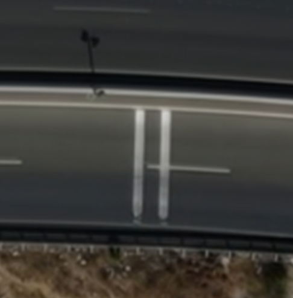 |
---


## License

This project is licensed under the MIT License - see the [LICENSE](LICENSE) file for details. 
